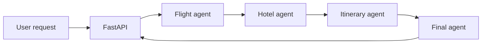
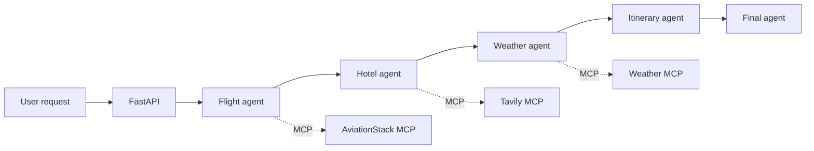
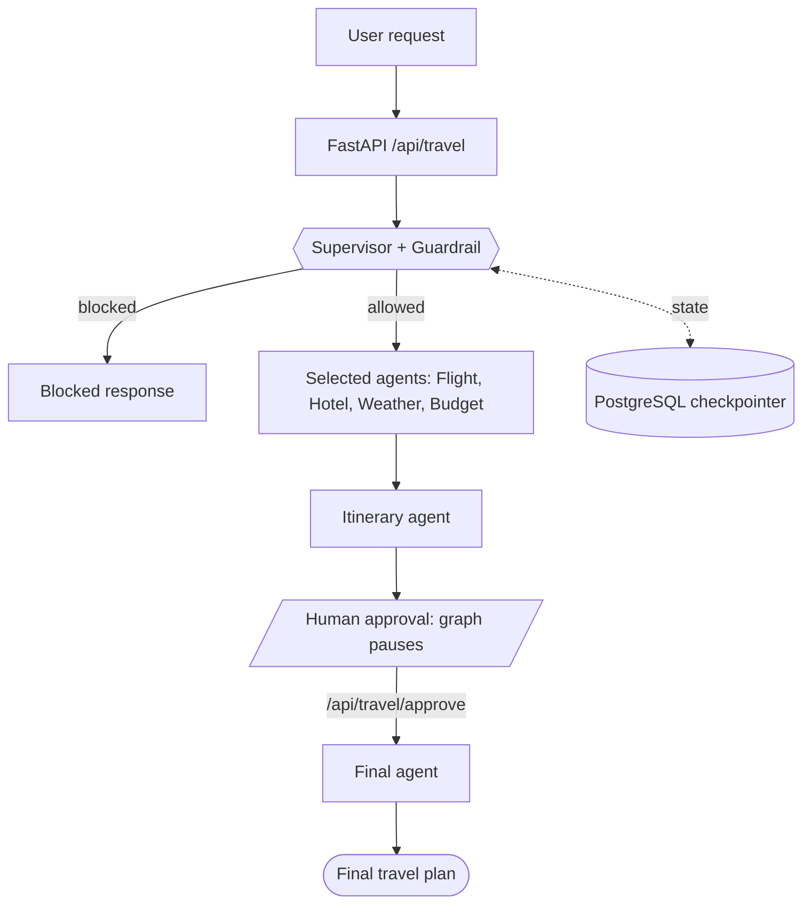

# Helmsman: Multi-Agent Trip Planner

## Three generations of a LangGraph travel planner: from a fixed agent pipeline, to MCP-based tools, to a supervisor-driven workflow with guardrails and human approval

Describe your trip in plain English. Get flight guidance, hotel ideas, weather and a day-by-day itinerary.


---

## Table of Contents

- [Overview](#overview)
- [Repository Layout](#repository-layout)
- [The Three Versions at a Glance](#the-three-versions-at-a-glance)
- [Evolution of the Architecture](#evolution-of-the-architecture)
- [Which Version Should I Use?](#which-version-should-i-use)
- [Shared Tech Stack](#shared-tech-stack)
- [Common Setup](#common-setup)
- [Running a Version](#running-a-version)
- [Shared Limitations](#shared-limitations)
- [Roadmap](#roadmap)
- [License](#license)

## Overview

Planning a trip usually means juggling flight sites, hotel searches, weather apps and spreadsheets. Helmsman collapses that into one request:

> *"Plan a 5-day trip to Japan from Hyderabad with a budget of $2000"*

This repository holds **three self-contained versions** of the same idea. Each folder is a complete, runnable app with its own `requirements.txt`, `.env` and detailed README. The versions build on one another, so you can read them in order to see how the design evolved.

## Repository Layout

```text
helmsman-multi-agent-orchestrator/
├── Helmsman_with_langgraph/                  # v1: fixed pipeline, direct API wrappers
├── Helmsman_with_mcp/                        # v2: every data source exposed as an MCP server
├── Helmsman_with_supervisor_guardrails_HITL/ # v3: supervisor, guardrail, budget agent, human approval
└── README.md                                 # this file
```

| Folder | Version | Detailed README |
| --- | --- | --- |
| [`Helmsman_with_langgraph`](./Helmsman_with_langgraph) | v1: LangGraph | [Open](./Helmsman_with_langgraph/README.md) |
| [`Helmsman_with_mcp`](./Helmsman_with_mcp) | v2: MCP | [Open](./Helmsman_with_mcp/README.md) |
| [`Helmsman_with_supervisor_guardrails_HITL`](./Helmsman_with_supervisor_guardrails_HITL) | v3: Supervisor + Guardrails + HITL | [Open](./Helmsman_with_supervisor_guardrails_HITL/README.md) |

## The Three Versions at a Glance

| | v1: LangGraph | v2: MCP | v3: Supervisor + Guardrails + HITL |
| --- | --- | --- | --- |
| **Workflow** | Fixed pipeline | Fixed pipeline | Supervisor picks agents per request |
| **Agents** | Flight, Hotel, Itinerary, Final | Flight, Hotel, **Weather**, Itinerary, Final | Supervisor, Flight, Hotel, Weather, **Budget**, Itinerary, Final |
| **Tool access** | Direct API wrappers in `tools/` | MCP servers via `langchain-mcp-adapters` | MCP servers via `langchain-mcp-adapters` |
| **Hotel search** | Tavily Python client | Tavily MCP server | Tavily MCP server |
| **Flight data** | AviationStack REST calls | AviationStack MCP server | AviationStack MCP server |
| **Weather** | Not included | Custom OpenWeather MCP server | Custom OpenWeather MCP server |
| **Input checking** | None | None | Guardrail blocks off-topic or harmful requests |
| **Human review** | None | None | Pauses for approval or revision feedback |
| **State persistence** | PostgreSQL | PostgreSQL (LangGraph checkpointer) | PostgreSQL (checkpointer, pause and resume) |
| **API** | `POST /api/travel` | `POST /api/travel` | `POST /api/travel` and `POST /api/travel/approve` |
| **UI** | Result only | Result only | Supervisor plan card, review card, final plan, PDF download |

## Evolution of the Architecture

### v1: LangGraph pipeline

Four agents run in a fixed order. Flights come from AviationStack, hotels from Tavily, and the LLM (Groq) writes the itinerary and the final answer.



### v2: MCP rewrite

The same pipeline, but tools are no longer hard-coded wrappers. Each data source runs as an MCP server and is loaded through one `MultiServerMCPClient`. A new weather agent is added.



### v3: Supervisor, guardrails and human-in-the-loop

A guardrail screens the request, a supervisor chooses which specialist agents to run, and the graph pauses after the itinerary draft until the user approves it or sends feedback.



## Which Version Should I Use?

| If you want to... | Use |
| --- | --- |
| Understand the basics of a LangGraph multi-agent workflow | `Helmsman_with_langgraph` |
| See how to plug MCP servers into LangGraph agents | `Helmsman_with_mcp` |
| Explore supervisor routing, guardrails and `interrupt`-based approval | `Helmsman_with_supervisor_guardrails_HITL` |
| Run the most complete and current version | `Helmsman_with_supervisor_guardrails_HITL` |

## Shared Tech Stack

| Layer | Tools |
| --- | --- |
| Language | Python 3.10+ |
| Backend | FastAPI, Uvicorn |
| Frontend | Jinja2, HTML, CSS, JavaScript |
| Orchestration | LangGraph, LangChain |
| Tool protocol | Direct APIs (v1), MCP with `langchain-mcp-adapters` (v2, v3) |
| LLM | Groq (`openai/gpt-oss-120b` by default in v2 and v3) |
| Database | PostgreSQL |
| External APIs | Tavily, AviationStack, OpenWeather (v2, v3) |

## Common Setup

Every version needs:

- Python 3.10 or newer
- A running PostgreSQL instance
- API keys for [Groq](https://console.groq.com/), [Tavily](https://tavily.com/) and [AviationStack](https://aviationstack.com/)
- An [OpenWeather](https://openweathermap.org/api) API key (v2 and v3 only)
- [`uv`](https://docs.astral.sh/uv/) installed so `uvx` can launch the AviationStack MCP server (v2 and v3 only)

Each folder has its own `.env`. Never commit `.env`.

| Variable | Used in | Description |
| --- | --- | --- |
| `DATABASE_URL` | All | PostgreSQL connection string |
| `GROQ_API_KEY` | All | Groq API key |
| `GROQ_MODEL` | v2, v3 | Groq model name; use one your account can access |
| `TAVILY_API_KEY` | All | Hotel search |
| `AVIATIONSTACK_API_KEY` | All | Flight data |
| `OPENWEATHER_API_KEY` | v2, v3 | Weather MCP server |
| `DEFAULT_ORIGIN_IATA` | v1 | Default departure airport (e.g. `HYD`, `DEL`, `BOM`) |

## Running a Version

```bash
git clone https://github.com/<your-username>/helmsman-multi-agent-orchestrator.git
cd helmsman-multi-agent-orchestrator/<version-folder>

python -m venv .venv
source .venv/bin/activate      # Windows: .venv\Scripts\activate
pip install -r requirements.txt

createdb travel_db
# create .env as described in the folder's README

python app.py
```

Then open **http://127.0.0.1:8000/**. Use a separate virtual environment for each folder, since their dependencies differ.

Each app exposes:

| Method | Endpoint | Available in | Description |
| --- | --- | --- | --- |
| `GET` | `/health` | All | Health check |
| `POST` | `/api/travel` | All | Submit a travel request |
| `POST` | `/api/travel/approve` | v3 only | Approve or revise the draft itinerary |

FastAPI interactive docs are served at **http://127.0.0.1:8000/docs**.

## Shared Limitations

- AviationStack provides airport, airline and schedule data, so there are no live fares or booking links.
- Hotel suggestions come from web search and should be verified before booking.
- Budget estimates are LLM-generated and approximate.
- Free API tiers have rate limits. On Groq's free tier, long runs can hit a `429`, and oversized prompts can hit a `413`.
- In v2 and v3, graph nodes are synchronous and call `asyncio.run(...)`, so API routes must stay plain `def` functions.
- In v3, the guardrail fails open: if the guardrail call or its JSON parsing fails, the request is allowed.

See each folder's README for version-specific troubleshooting.

## Roadmap

Ideas for future versions:

- Live fare and booking data
- Async graph nodes
- A second approval round after revisions
- Persistent MCP server connections to cut per-request latency

## License

This project is licensed under the Apache License 2.0. See [LICENSE](LICENSE).
